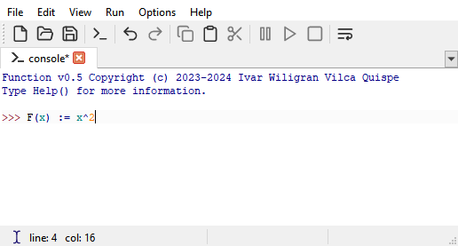

## Function

_Function_ is an functional programming language and an application to write mathematical functions easily, with imperative structures.

The language is based on the article "Representation of the while loop and the  conditional structure in lambda calculus with eager β-reduction" by Vilca Quispe [^1] and solves the problem of compiling imperative structures to lambda calculus and typed lambda calculus.

### Screenshots

[^1]: Vilca Quispe, I. W. (2023). Representation of the while loop and the conditional structure in lambda calculus with eager β-reduction. Revista del Altiplano de Ciencias Básicas y Aplicadas. 
